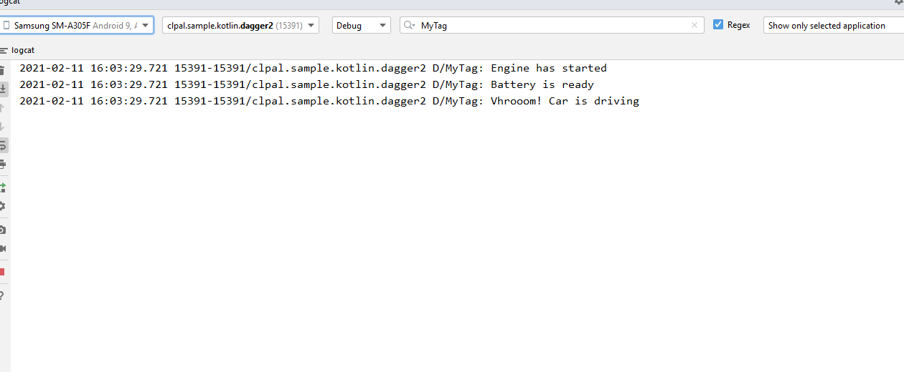

# Dagger 2
#Dagger is a fully static, compile-time dependency injection framework for Java, Kotlin, and Android. It is an adaptation of an earlier version created by Square and now maintained by Google.
Example Constructor Injection. 

##### <b> Attaching some screenshots: </b> 
#--------Example 1---------
## Constrctor ->@ Component ->@Inject
# val hondaCar = DaggerCarInjector.create().getCar()

#Spark Plug,Piston,CrankShaft--> Engine
# Rubber,Frame--> Wheels
# Engine,Wheels-->Car
#Car--> MainActvity
# Car is Top level Factory

  />

