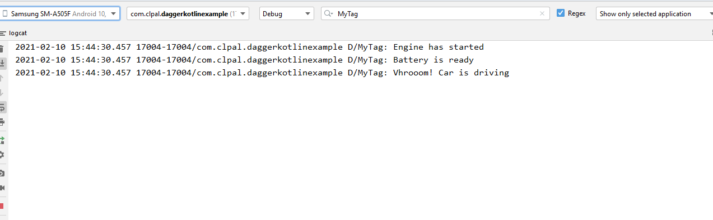

 # --------Example 2---------
Sample example 2 Field Injection. 
Field injection is mainly used to inject variables into Android framework types that the system instantiates and on which we can’t do constructor injection, like activities, BroadcastReceivers and fragments.

  Field Injection ->@ Component ->@Inject
 # 1  fun injectFields(mainActivity: MainActivity)
Component  comment create context of interface in MainActvity class

 # 2 DaggerCarInjector.create().injectFields(this)
 retrive context of Injector class @ Component in MainActvity class 
# 3@Inject lateinit var hondaCar: Car  
member or field inject in mainactvity  and lateinit private memeber could not be use
# call method using the field refrence
 
